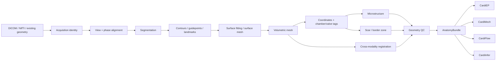

<div align="center">

# Virelion CardiAnatomy

**Imaging → anatomical twin → simulation-ready cardiac geometry**

[](https://github.com/Virelion-Biotech/Virelion-CardiAnatomy/actions/workflows/ci.yml)


</div>

CardiAnatomy is the **patient-specific anatomy and spatial-geometry layer** of the Virelion HeartTwin stack. It provides typed contracts, provenance, staged orchestration, geometry QC, coordinate-frame handling, microstructure/scar utilities, external-tool adapters, and readiness gates for downstream electrophysiology, mechanics, and flow models.

It is designed around the strongest ideas in modern open cardiac-model construction pipelines while keeping **scientific algorithms swappable and licensing explicit**.

## Why this exists

A digital twin cannot be patient-specific if its geometry is just a filename. CardiAnatomy makes anatomy an auditable computational object:



## What is implemented now

- **Cardiac anatomy contract v2.0.0** with artifact lineage, frames, registrations, labels, stage records, QC, and fingerprints.
- **Target-specific readiness gates** for surface workflows, EP, mechanics, and flow.
- **Resumable staged pipeline executor** with deterministic stage fingerprints and JSON sidecars.
- **Mesh QC** for triangle surfaces and tetrahedral volumes: degeneracy, connectedness, orientation consistency, manifold/boundary edges, edge scales, normalized mean-ratio/scaled-Jacobian shape quality, and finite values.
- **DICOM inspection** that intentionally omits direct patient identifiers and hashes SeriesInstanceUID values.
- **NIfTI inspection** for shape, voxel spacing, affine, and finite transforms.
- **MeshIO integration** for VTK/VTU/Gmsh/etc. inspection through an optional dependency.
- **DICOM-LPS ↔ NIfTI-RAS transforms** and generic homogeneous point transforms.
- **Reference rule-based myocardial microstructure utility** for already-computed local coordinates; explicitly not a validated LDRB replacement.
- **Rigid paired-landmark registration** with residual diagnostics for explicit frame alignment.
- **Solver-neutral geometry measurements** including surface area, tetrahedral volume, oriented closed-surface volume, bounds, and scale metrics.
- **Segmentation QC and label-volume utilities** with canonical cardiac structure naming.
- **Metadata-only cine series triage** for SAX/2CH/3CH/4CH hints, explicitly labeled heuristic rather than validated view classification.
- **Segmentation-derived cine volume curves and ED/ES phase selection** with stroke-volume/ejection-fraction summaries and minimum dynamic-range safeguards.
- **Validated affine composition/inversion primitives** for explicit coordinate-frame chains and round-trip checks.
- **Dense-correspondence comparison** with connectivity fingerprints and explicit displacement summaries, without conflating identical connectivity with proof of diffeomorphism.
- **3D+t mesh-motion summaries** with reference-phase displacement, inter-phase motion, vertex path length, and optional cyclic-closure error.
- **Explicit scar/border/core threshold application** without pretending to estimate clinically valid LGE thresholds.
- **License-aware toolchain manifests** that track model weights, atlases, executables, versions, hashes, and deployment policy.
- **Native ingest, geometry-QC, and export stages** plus resumable stage sidecars that restore output artifacts and QC correctly.
- **Canonical pipeline presets** for cine-CMR biventricular construction, presegmented EP preparation, and mesh-QC workflows.
- **License-aware external tool catalog** spanning classical, statistical, whole-heart, and learned reconstruction stacks, including nnU-Net, biv-me, BiV volumetric meshing, MorphiNetV2, Bi-PT, HeartVolMesh, MeshHeart, TetHeart, cardiac-geometriesx, MyoMesh, Meshtool, AugmentA, atrialmtk, and openCARP.
- **Safe subprocess command builders** for nnU-Net, biv-me, BiV volumetric meshing, MyoMesh, cardiac-geometriesx, fenicsx-ldrb, Meshtool, MorphiNetV2, and Bi-PT without shell interpolation.
- **Self-contained HTML bundle reports**.
- **Versioned JSON schemas** and schema-drift CI.

## Installation

Base package:

```bash
python -m pip install -e '.[dev]'
pytest -q
cardianatomy doctor
```

Minimal runtime:

```bash
python -m pip install -e .
```

Imaging and mesh file support:

```bash
python -m pip install -e '.[io]'
```

The base library intentionally does **not** pull GPU segmentation stacks, FEniCS, openCARP, VTK, or CFD solvers into every environment.

## CLI

```bash
cardianatomy doctor
cardianatomy tools
cardianatomy presets
cardianatomy hash path/to/artifact.vtu
cardianatomy inspect-dicom path/to/dicom_folder
cardianatomy inspect-nifti image.nii.gz
cardianatomy inspect-mesh heart.vtu
cardianatomy inspect-mesh closed_surface.vtk --require-watertight
cardianatomy validate anatomy-bundle.json --target ep
cardianatomy report anatomy-bundle.json anatomy-report.html
cardianatomy register-rigid source-landmarks.json target-landmarks.json
cardianatomy audit-manifest toolchain.json
cardianatomy cine-phases chamber-volumes.json
cardianatomy compose-affines affine-chain.json
cardianatomy invert-affine affine.json
cardianatomy compare-correspondence examples/correspondence_payload.json
cardianatomy summarize-motion examples/motion_payload.json
```

## Readiness is not one boolean

A mesh that is adequate for one downstream task may be insufficient for another.

| Readiness | Minimum intent |
|---|---|
| `surface` | segmentation + surface mesh |
| `baseline` | segmentation + surface mesh + volume mesh + passing QC |
| `ep` | volume geometry + coordinate field + fiber field + passing QC |
| `mechanics` | volume mesh + passing QC |
| `flow` | surface mesh + passing QC |

These are **software readiness gates**, not biological or clinical validation claims.

## External ecosystem strategy

CardiAnatomy does not fork every research codebase. It keeps a stable Virelion contract and uses external backends according to their licenses and deployment characteristics.

| Upstream | What we borrow | Integration policy |
|---|---|---|
| `UOA-Heart-Mechanics-Research/biv-me` | DICOM view selection, temporal harmonization, guidepoints, model fitting, visual QC | Apache-2.0; adapter-friendly |
| `cdttk/biv-volumetric-meshing` | explicit segmentation→contours→surface→volume→UVC/fiber staging | Apache-2.0; adapter-friendly; openCARP stages separately gated |
| `MIC-DKFZ/nnUNet` | self-configuring segmentation backend pattern | Apache-2.0; external model adapter |
| `ComputationalPhysiology/cardiac-geometriesx` | clean geometry objects, solver-ready exports, idealized fixtures | MIT; adapter-friendly |
| `FISIOCOMP-UFJF/MyoMesh` | DICOM alignment, scar handling, fibers, mesh-processing flow | MIT; adapter-friendly |
| `LoreVanSantvliet/BiventricularSSM` | SSM/synthetic cohort workflow | MIT; synthetic/research backend |
| Meshtool | conversion, extraction, mapping, smoothing, QC concepts | GPL-3.0; external-process integration |
| LDRB | rule-based fiber methodology | LGPL-3.0+; optional external/backend integration |
| AugmentA | atrial orifice/landmark/SSM/fiber architecture ideas | non-commercial academic license; **not enabled by default** |
| openCARP | UVC/fiber/simulation ecosystem | academic/commercial dual licensing; **explicit deployment review required** |
| CEMRG HeartBuilder | whole-heart modular pipeline and robust external-tool orchestration | license text unclear in repository review; architecture reference only by default |
| MorphiNetV2 | dense-correspondence biventricular reconstruction | MIT software; weights/data reviewed separately; correspondence concepts integrated |
| Bi-PT | sparse-CMR four-chamber atlas deformation with semantic correspondence | MIT software; experimental learned backend; correspondence concepts integrated |
| HeartVolMesh | template-driven tetrahedral correspondence and simulation-oriented element QC | Apache-2.0 repository; implementation/templates not yet released upstream |
| MeshHeart | personalized 3D+t mesh representation | MIT; representation/reference architecture, not a patient-measurement backend |
| TetHeart | 4D tetrahedral recovery from full/sparse CMR | license unresolved in repository review; architecture reference only |

See `docs/RESEARCH_SURVEY_2026-10-01.md`, `docs/UPSTREAM_MATRIX_2026-10-02.md`, `docs/VALIDATION.md`, and `THIRD_PARTY_NOTICES.md`.

## HeartTwin contract

CardiAnatomy advertises:

- `anatomy.health`
- `anatomy.build`
- `anatomy.validate`
- `anatomy.tools`
- `anatomy.microstructure.reference`
- `anatomy.scar.classify`
- `anatomy.presets`
- `anatomy.registration.rigid`
- `anatomy.geometry.measure`
- `anatomy.manifest.audit`
- `anatomy.series.rank`
- `anatomy.segmentation.qc`
- `anatomy.cine.phases`
- `anatomy.transforms.compose`
- `anatomy.transforms.invert`
- `anatomy.correspondence.compare`
- `anatomy.motion.summarize`
- `anatomy.validation.segmentation`
- `anatomy.validation.points`

HeartTwin should persist the returned `AnatomyBundle` as a typed artifact and enforce the correct downstream readiness gate before calling CardiEP, CardiMech, or CardiFlow.

## Scientific boundary

CardiAnatomy is research infrastructure. A valid schema, clean mesh, successful segmentation backend, or passing geometric QC does **not** establish anatomical truth, segmentation accuracy, clinical validity, regulatory suitability, or patient benefit. Every algorithm and model requires validation appropriate to its intended use.

## License

Virelion CardiAnatomy is licensed under AGPL-3.0-or-later. Third-party tools, model weights, datasets, and optional runtimes retain their own licenses and terms.
